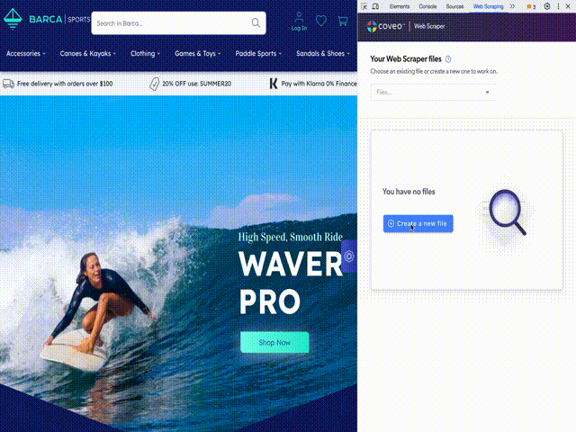

# Chrome Extension

The web-scraper-helper Google Chrome extension allows you to easily create and test web scraping configurations to use with Coveo Cloud V2 Web and Sitemap source types.

The web scraping configuration developed with the extension can tell the crawler to exclude web page sections and extract metadata (see [Web Scraping Configuration](https://docs.coveo.com/en/mc1f3573/index-content/web-scraping-configuration)). The extension does not currently support testing the creation of sub-items.

The extension provides both a GUI and a JSON text editor to create, save, and test your web scraping configuration on specific pages, and immediately see the results.

## Installation

The extension is publicly available on the [chrome web store](https://chrome.google.com/webstore/detail/web-scraper-helper-for-co/demelhhhnkocnphihjbhpafjnknknkdf).
This is the preferred way to install it.

# Build

If you want to contribute, feel free to download the code, build, modify and submit Pull Requests.
Here are the build steps.

1. Download/clone this Git repo.
1. Build React app (see next section)
1. In Google Chrome:
   1. Go to the **Extensions** page.
   1. Select the **Developer mode** check box.
   1. Click **Load unpack extension**.
   1. Browse the `chrome_extension` folder of the repo, and then click **Select**.
   1. Ensure the **Enabled** check box is selected for the web-scraper-helper extension.

## Build Stencil Application

The UI in the Developer tools is done using Stencil. You need to build the Stencil application before installing the Chrome Extension.

1. in folder `../panel-app`
1. do `npm install`
1. then `npm run build`

## Usage

1. With Google Chrome, go to any web page for which you want to create a web scraping configuration.
1. Open the Chrome Developer tools (Mac: alt+cmd+I | Windows: Control+Shift+I).
1. In the Developer tools pane, select to the new **Web Scraping** tab, and then:

   1. Click **Create a new file** to be able to start the configuration.
   1. Exclude a section of the page (such as the header that you typically do not want to index).

      The excluded section appears with a semi-transparent white overlay.

   1. Click on the **Metadata to extract** tab. Extract a piece of the page as a metadata.

      The extracted value appears in the **Metadata name** and **Value** table.

      Demo:
      

   1. Click **Save** once you are happy with your web scraping configuration.

1. Test and fine-tune your web scraping configuration with other pages to which it applies.
1. Once happy with the web scraping configuration, use the content of your saved file by clicking on the **Copy to clipboard** in the **JSON** tab.
1. In the Coveo Cloud V2 administration console, paste your JSON web scraping configuration to your source configuration:
   - Web source (see [Add/Edit Web Source - Panel](https://docs.coveo.com/en/malf0160/index-content/add-or-edit-a-web-source))
   - Sitemap source (see [Add/Edit Sitemap Source - Panel](https://docs.coveo.com/en/1967/index-content/add-or-edit-a-sitemap-source))
1. Rebuild your source.
1. Validate that your web scraping configuration performed as expected on all source items.

## Dependencies

Google Chrome or Chromium

## References

- https://developer.chrome.com/extensions/getstarted
- https://github.com/lgcarrier/coveo-developer-insight-panel
