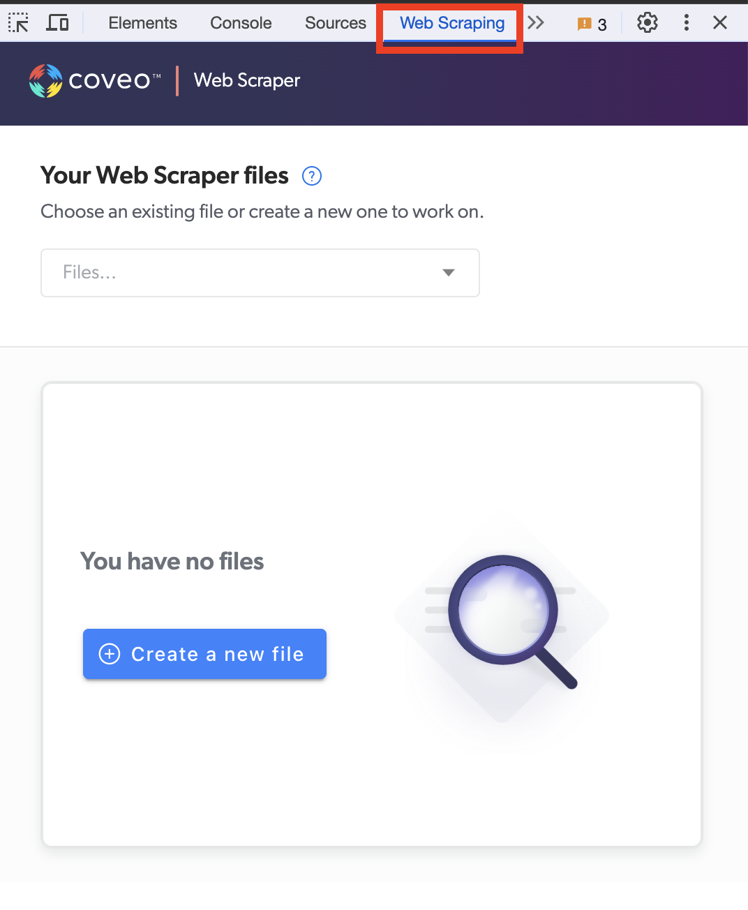
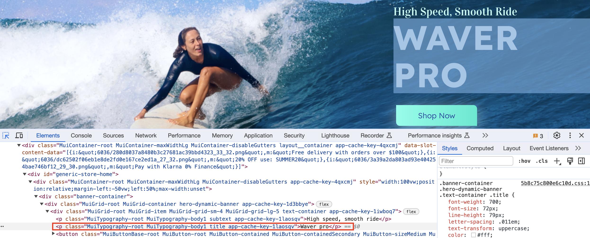
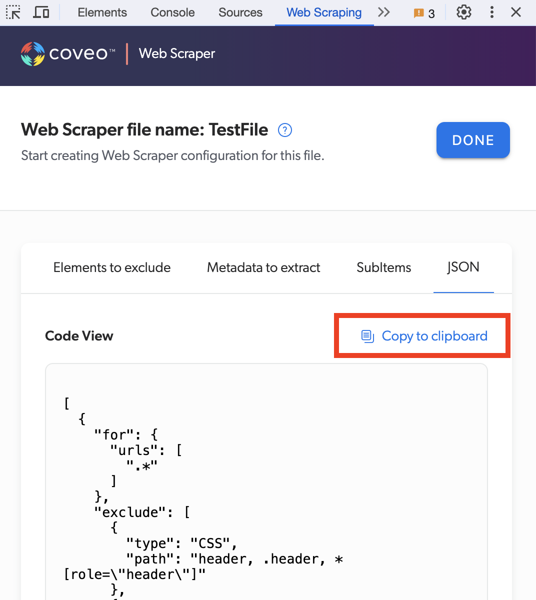

# How to use the Web Scraper panel

You can boost search result relevance by taking advantage of this feature. Read more information on the official Coveo documentation site - [Web Scraping Configuration](https://docs.coveo.com/en/1874/index-content/web-scraping-configuration).

_To install this extension in your Chrome browser, follow these [installation steps](./install.md)._

## How-to Guide

1. Open `View > Developer > Developer Tools` or `Option + ⌘ + J` (on macOS), `Shift + CTRL + J`(on Windows/Linux).
   
1. Find a Web Scraping tab (like show on the screenshot above)
   
1. Click “Create New File” to start a new Web Scraping configuration for your site and source
1. To pick a specific part of the desired web page, use Select Element (as on screenshot or `Ctrl + Shift + C`)
   
1. When you select a part of the screen, a line of the HTML code will get selected too.
   
1. Right click on that highlighted line and either copy CSS or XPATH.
   
1. Paste CSS or XPATH into the corresponding box inside Web Scraping
   
1. Fill in your desired Exclusion filters and Metadata accordingly. When done, copy your configuration to clipboard and paste it in Coveo Administration Console - Web Source Web Scraping field.
   
