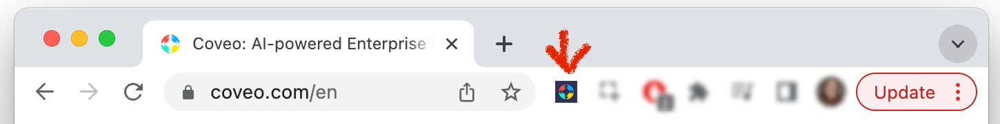

# Web Scraper panel - Install

You can boost search result relevance by taking advantage of this feature. Read more information on the official Coveo documentation site - [Web Scraping Configuration](https://docs.coveo.com/en/1874/index-content/web-scraping-configuration).

## How to install

From the Chrome Web Store, find the extension [Web Scraper Helper for Coveo Web Sources](https://chrome.google.com/webstore/detail/web-scraper-helper-for-co/demelhhhnkocnphihjbhpafjnknknkdf?hl=en-US).

Click `Add to Chrome`.

Then, make sure to enable the extension:

You are ready for the [How-to Guide](./howto.md)
